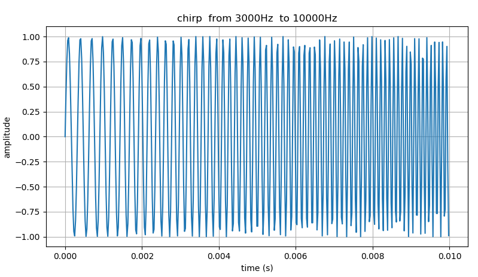
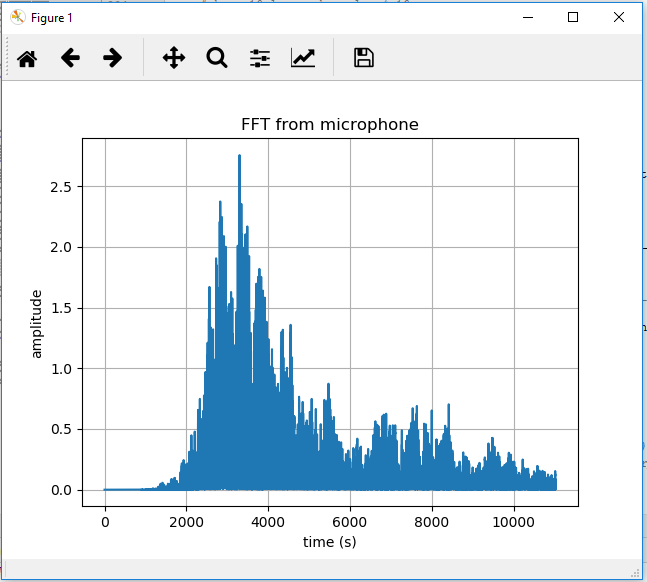
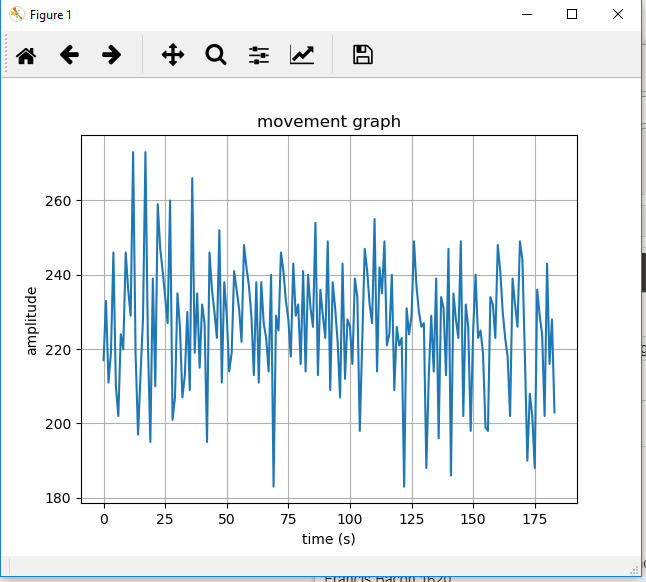

# Partial implementation of the ApneaAPP paper - FMCW sonar
The technique described in the original paper has the capacity to monitor the breading abdominal movements in a sleeping person, normally used to detect sleep apnea.  

## Description
This is a partial implementation of the paper, it implements (independently) the sonar part, not the medical part, and it is here only to help others understand better the technique with my example code, I hope that the technique could be useful for something (not my code directly). <br> 
<br>
I would like to talk about a technique to measure breading rate, more precisely respiratory abdominal movement (making a graph of it in time) with a phone, a tablet, a Raspberry Pi or a computer. This is currently used by several APPs for Sleep Apnea detection (I don't know if there are patents and I only used to try to understand it). But I think (wold guess) that the technique could be used for monitoring patients in a room or at home for their breading patterns and alert other family members that the ill person is breading with difficulty or if it is in a hospital bed in a room. The distance between patients can be used to make the detection on more than one person in simultaneous. This uses any phone or computer that has a speaker and a microphone. The development necessary is only software. This is only a wild guess, I'm not a doctor, i'm not a scientist, I'm not a medical engineer. <br>
<br>
See the video in this link <br>
https://apnea.cs.washington.edu/ <br>
<br>
[ApneaAPP](https://apnea.cs.washington.edu/)<br>
<br>
And the paper in <br>
ApneaApp: Sleep Apnea Detection on Smartphones <br>
https://apnea.cs.washington.edu/apneaapp.pdf  <br>
<br>
[Paper](https://apnea.cs.washington.edu/apneaapp.pdf) <br>
<br>
I have read the paper some time ago and implemented part of it, although I made this small exploration code that only works OFF-LINE and I only used it in 2018 to learn the more about the technique because it fascinated me. But it’s not really difficult to implement if you use the math library of a language like Python (NumPy/ScyPy). It’s based on concepts of radar/ sonar but not very difficult if you read the paper. You can use the frequencies between 18KHz and 22KHz that are not audible, so you can sleep next to it. An adult person can’t hear much past 16KHz.

## Chirp emitted
A chirp is a tone frequency ex: a cos or a sin, that goes continually from  frequency A to frequency B. A tone that rises continually in frequency. <br>



## The frequency response of my computer laptop audio system
FFT of the signal at the input of the microphone of my computer. As you can see it's not a horizontal line as it should be. That is the frequency response of my computer built in audio microphone is not equal in all frequencies. <br>



## Graph of the movement detected, of a A4 wooden plate going back and forward
This is the end result of this code. <br>



## More in depth description - this was I wrote about it to some friends when I made this back in 2018
Hello, good night, <br>
Yesterday night and today I have been trying tyo implement one prototype of the ideas that are in the paper of ApneaApp. Only the part of the sonar of FMCW of the movement detection  and not the part of the medical classification of sleep apneas from the abdominal movements. This last part I don't have medical knowledge to do it. <br> 
<br>
Video e Paper: <br>
ApneaApp: Sleep Apnea Detection on Smartphones <br>
http://apnea.cs.washington.edu/    <br>
<br>
Basically my code that I give here is only a prototype poorly made, but it seems to be working correctly. <br>
My small program has two parts: <br>

**Part 1** <br>
<br>
In the first part you run the program that uses the PyAudio Lib in real time: <br>

```
python   realtime_audio_simple.py
```

it will generate a chirp of 10 milliseconds (Continuously audio tone wav (cosine) that sweeps the frequencies between 3KHz and 10KHz, in a pattern of rising saw tooth, repeated 1000 times (10 seconds) to alow the detection of movement up to a distance of 1 meter. You could change the range if you change de chirp length in time. <br>
 
While generating the sound the some program records the audio from the microphone, that means that it saves the direct path between the speaker and the microphone (the shortest physical path) and records the audio corresponding to the echo of the different object that are in the room at a distance of up to a meter. It records more then a meter in range but for our purposes of this prototype just to learn about the technique, we are only interested in the movement of objects up to a meter. <br>
It also records the echo of the moving objects in the room. At the end it generates one WAV file.<br>
To develop and test the program that makes the automatic analysis of the data, I generated one WAV with the first program moving back and forward a A4 paper size, wooden board. <br>    
This first program also as the code to generate the white noise and with that allow you to analyse the frequency response of your PC/Laptop audio system (combine speaker and microphone). In my case the frequency response of my old computer isn't very good and so I had to choose a frequency range between 3KHz to 10Khz, instead of 18KHz to 22KHz that would transform the system in a inaudible system for most persons. <br>

**Part 2** <br>
<br>
After we made the WAV audio recording, we have to execute the second program <br>

```
python  analyze_FMCW.py
```

This program works OFF-LINE because it's easier to develop, experiment and test the algorithms in this way. In a second phase this algorithms could be integrated in the first program  and they would work in real-time (ON_LINE), like the first program. 
The second program starts by reading the WAV audio file, that the first program recorded, it applies an high pass filter to remove the DC component of the signal and the noise of the cooling turbine of the laptop :-D  . <br>
It makes plot's of chirp's, it makes plot's of FFT's, it makes plot's of spectrograms,and it makes animated plot's that will permit to see the variation along the time.  <br>
This development was some what exploratory so this graphs were very useful. <br>
In this second program we recreate the original chirp data of the first program, we use it so we can make the cross correlation of the signal emitted by the speakers and the signal received by the microphone so that we can synchronize the initial point of the chirp emission. <br>  

Once we discover, the initial point of the sequence of samples is correctly determined. With this, we remove the sub-sequence without audio/chirps of the beginning and focus our future analysis processing on the audio between each chirp, or block of chirp (5 to 10 in each time, that is  50 milliseconds ou 100 milliseconds). In this way when we calculate the FFT, it will give must more resolution in the detection of the real physical movement. <br>  
After this, we need to find the static echos (echos of the static objects), for this we will do the average of all the chirp windows recorded by the microphone, so that we can obtain what is fixed and doesn't change. Other way to do it, would be to capture one sequence of chirps without movement, or only do some movement after some samples. But I didn't recorded in that way in program 1, so I have to make it with the average, but I think it is working correctly. <br>
The total buffer is segmented in sub arrays of 5 to 10 chirps and to each one of them we will be removing the echos of the average chirp, removing in this way the the static echos and the original chirp of the emitter. <br>  
<br>
**Note:** We can only do this because the sequences are synchronized. Then after that, we have only the objects non static echos (reflections) in each buffer. We will multiply each chirp, implementing some kind of RF mixer (mixer of frequencies) but for audio and with that obtaining the frequency of the echos with a delta in time, in terms of the frequency to the emitted chirp. But this time, only the variation of the sum and difference of frequencies given by the mixer. We calculate the FFT of a group of 5 or 10 chirps and apply a pick detector to the part of the variation of the sums and with that generate a graph with the movement of the A4 wooden board. <br>    
<br>
In the source code I implemented an animation of the dynamic echo along the time (of the objects that are moving) and show in the end, one graph of the movement that was detected. <br>
For more detailed information's about how the algorithm please read the paper in the section of FMCW.

## License
MIT Open Source license. 

## Have fun!
Best regards, <br>
Joao Nuno Carvalho
